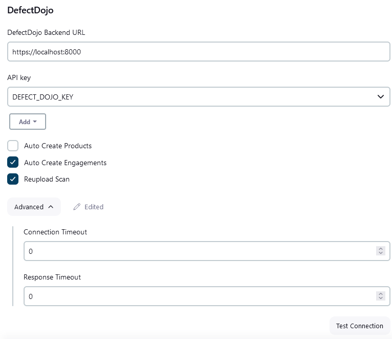
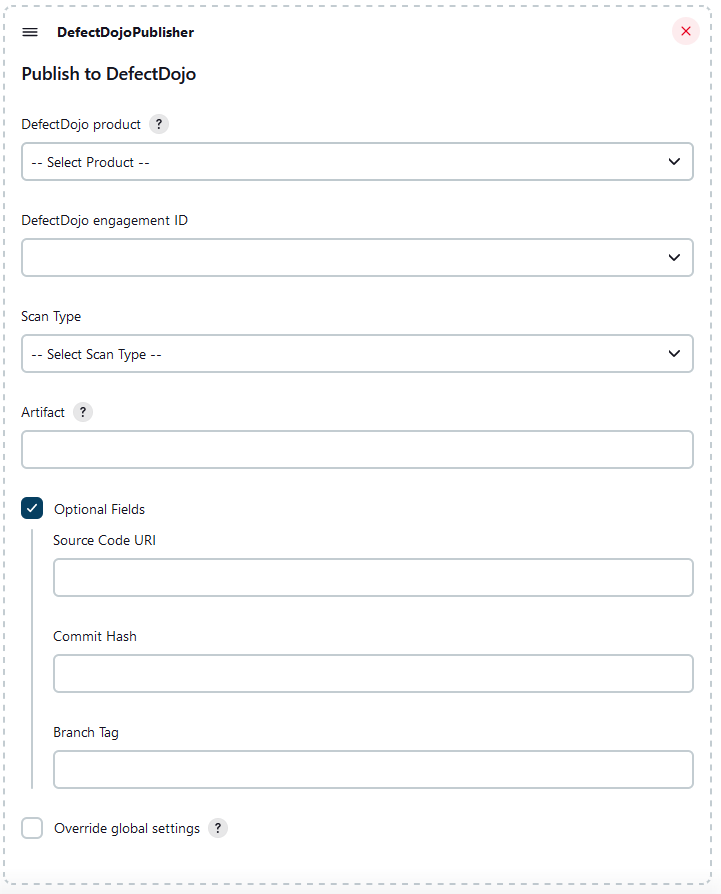

# DefectDojo Jenkins Plugin

The [DefectDojo](https://www.defectdojo.com/) Jenkins plugin that helps integrate Jenkins CI with syncing with DefectDojo.

[DefectDojo](https://www.defectdojo.com/) automates away security drudgery. The data model allows for a high level of flexibility providing continuous feedback and optimization across entire security program and DevSecOps pipeline. 

It stores, normalizes, and deduplicates results from over 160 security tools and converts them to a single actionable report. With less noise in the system, DevSecOps activities are prioritized to match the SLAs set.

## Global Configuration
To setup, navigate to Jenkins > System Configuration and complete the DefectDojo section.



**DefectDojoBackend URL**: URL to your DefectDojo instance.

**API key**: API Key used for authentication.


**Auto Create Products**: auto creation of products by giving a product name.

**Auto Create Engagements**: auto creation of products by giving a product name.

**Reupload Scan**: reupload scan results.

**Connection Timeout**: Defines the maximum number of seconds to wait for connecting to DefectDojo.

**Response Timeout**: Defines the maximum number of seconds to wait for DefectDojo to respond.


## Job Configuration
Once configured with a valid URL and API key, simply configure a job to publish the artifact.



**DefectDojo Product**: Specify unique ID of the product in DefectDojo

**DefectDojo Engagement**: Secify the unique ID of the engagement in DefectDojo

**Scan Type**: Select the Scan Type

**Artifact**: Specifies the file to upload. Paths are relative from the Jenkins workspace. The use of environment variables in the form `${VARIABLE}` is supported here.

**Optional Fields**: Some optional fields that can be passed
- _Source Code URI_: The URI of the SCM
- _Commit Hash_: The commit hash
- _Branch Tag_: The branch name

**Override global settings**: Allows to override global settings for "Auto Create Products", "DefectDojo URL", "API key", "Auto Create Engagements", "Reupload Scan" and the various timeouts.

## Examples
### Declarative Pipeline

```groovy
pipeline {
    agent any

    stages {
        stage('DefectDojoPublisher') {
            steps {
                withCredentials([string(credentialsId: 'CREDENTIALS_ID', variable: 'API_KEY')]) {
                    defectDojoPublisher(artifact: 'target/dependency-check-report.xml', productName: 'my-product', engagementName: 'ci/cd', defectDojoApiKey: API_KEY, sourceCodeUri: 'https://git.com/org/project.git', branchTag: 'main')
                }
            }
        }
    }
}
```